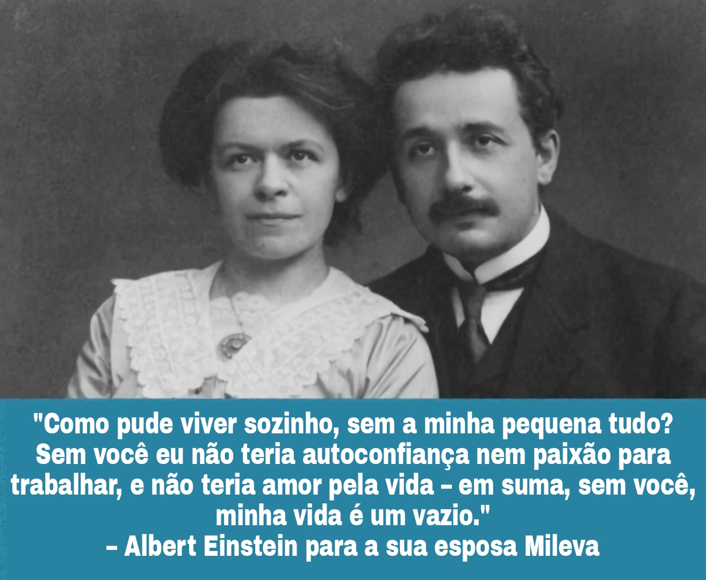

+++
title = "Efeitos Adversos da Incelidade"
categorias = [ "Teoria", "Ciência", "Artigos Classe-A" ]
description = "Pouco se sabe sobre os efeitos adversos da incelidade, já que essa é uma área pouco estudada. A maior parte dos resultados demonstram apenas correlações, então não se pode dizer se é a incelidade que causa uma condição adversa ou vice-versa, ou se é algum outro fator que causa ambos. Não existem estudos longitudinais sobre incels que ascenderam ou casaram."
images = [ "/images/Einstein-Mileva.jpg" ]

[original_article]
title = "Adverse effects of inceldom"
link = "https://incels.wiki/index.php?title=Adverse_effects_of_inceldom"
+++

Pouco se sabe sobre os efeitos adversos da incelidade, já que essa é uma área pouco estudada. A maior parte dos resultados demonstram apenas correlações, então não se pode dizer se é a incelidade que causa uma condição adversa ou vice-versa, ou se é algum outro fator que causa ambos. Não existem estudos longitudinais sobre [incels](/w/incel) que [ascenderam](/w/deincelizacao) ou [casaram](/w/casamento). 



## Falta de sexo reduz o bem-estar, a saúde e a produtividade
Um estudo de 2008 publicado no American Journal of Public Health descobriu que atrasar a atividade sexual pode "criar riscos à saúde por impedir o desenvolvimento das habilidades emocionais, cognitivas e interpessoais que são cruciais para um funcionamento sexual satisfatório e para o bem-estar geral."[^1] Por definição, aqueles que tiveram a primeira relação sexual aos 22 ou depois foram considerados "iniciantes tardios."

Um estudo de 2013 feito pelo Guttmacher Institute sumarizou um grande número de descobertas de associações positivas entre atividade sexual e satisfação sexual com melhora de saúde física e mental.[^2] Essas associações positivas acontecem mesmo nos idosos.[^3]

Cohen (2019) relatou um aumento na mortalidade entre americanos brancos não-casados.[^4] O casamento parece ter um efeito protetivo na saúde, e Rendall (2011) descobriu que esse é o caso especialmente para homens.[^5][^6][^7] Um estudo de 2020 encontrou que a busca por metas evolucionariamente relevantes -- como a reprodução e o cuidado por membros da família -- ajudam a promover um senso de propósito na vida.[^8] Porém, outro estudo baseado na U.S. national survey concluiu que a falta de sexo não está relacionada com a felicidade auto-declarada,[^9] embora um grande número de participantes idosos sexualmente inativos (especialmente mulheres, que têm uma [libido]() mais baixa) possam distorcer os resultados e mascarar a felicidade de homens jovens derivada do sexo.[^10]

Um estudo da Grécia descobriu que a performance reprodutiva está significativamente ligada à felicidade e à satisfação com a vida para ambos os sexos.[^11] Os autores sugeriram que uma grande população com falta de atividade sexual poderia afetar a economia negativamente devido à um maior gasto público acarretado por uma maior quantidade pessoas desmotivadas e depressivas. De fato, a felicidade da população pode aumentar a produtividade de um país.[^12][^13] É estimado que apenas nos EUA os custos da depressão cheguem a 65 bilhões de dólares por ano.[^14] Também é sabido que o sexo é a atividade mais prazerosa de todas.[^15] E mais, fazer sexo melhora o bem-estar nas próximas 48 horas (o "afterglow sexual").[^16] Um estudo resumiu:
> Além de efeitos positivos e negativos, o sexo tem implicações no significado da vida. Em dias em que as pessoas fazem sexo, um maior senso de significado na vida é sentido no dia seguinte. Significado na vida geralmente aumenta quando um indivíduo sente que sua necessidade básica de pertencimento é cumprida com alguém (Hicks & King, 2009; Lambert et al., 2013). Sexo requer um nível de vulnerabilidade e confiança que facilita oportunidades para conecções sociais profundas e significativas ([Baumeister](/w/roy-baumeister) & Leary, 1995; Deci & Ryan, 2000).[^17]

Fazer com que casais que moram juntos tenham mais sexo não os faz mais felizes.[^18] Aumentos naturais na frequência sexual ao longo do tempo, entretanto, preveem aumentos correspondentes na satisfação com a vida.[^19]

Uma pesquisa descobriu que sexo vaginal é associado com saúde, mas a masturbação e sexo anal não são.[^20] Isso sugere que a incelidade tenha efeitos adversos que não podem ser remediados por masturbação, i.e. o problema da incelidade não é apenas uma falta de estímulo genial, ao contrário do que [bluepillers](/w/bluepillsplaining) dizem.

Outros benefícios do sexo:
* **Longevidade:** Um estudo de adultos mais velhos descobriu que sexo nos anos após um infarto reduziram o risco de morte por *um terço*.[^21][^22]
* **Satisfação com o trabalho:** Pessoas tiveram melhor humor e engajaram mais com seus trabalhos no dia seguinte após fazer sexo.[^23]
* **Sistema imunológico:** Estudantes universitários que mantiveram relações sexuais algumas vezes na semana tiveram maiores nívels do anticorpo imunoglobulina A (IgA).[^24]
* **Auto-estima:** Pessoas que fazem sexo tendem a ter maior auto-estima.[^25]
* **Redução na pressão sanguínea e no estresse:** Sexo reduz a pressão.[^26][^27]
* **Saúde cardiovascular:** O risco de doenças cardiovasculares foi 45% maior em homens que fizeram sexo apenas uma vez por mês ou menos.[^28]
* **Exercício:** Sexo queima em média 85 calorias (3,6 cal./min.).[^29]
* **Alivia dores de cabeça:** 60% dos pacientes de enxaqueca e 37% dos de cefaléia em salvas se sentiram melhor após o sexo.[^30]
* **Sono:** Sexo promove um sono melhor.[^31]

## Benefícios do casamento

Estar casado indicou uma recuperação da depressão mais de duas vezes maior (2,4).[^32] Participantes não casados tiveram risco 42% maior de desenvolver demência (n = 800.000, Reino Unido).[^33] Casamento é associado com uma melhor saúde mental.[^34] Indivíduos em relacionamentos tiveram menos problemas de saúde mental e tiveram menos chance de ter obesidade e sobrepeso (n = 1.621).[^35] No Reino Unido, ser casado era o segundo fator mais importante para a felicidade dos homens. Homens solteiros são os menos felizes, menos do que divorciados e menos até do que viúvas.[^36] Existe uma relação significante entre ser solteiro, sintomas somáticos, ansiedade e insônia, depressão severa e solidão. Solteiros voluntários têm um nível menor de solidão romântica do que solteiros involuntários.[^37] Menos de 5% dos solteiros preferiram continuar solteiros ao invés de estar em um relacionamento, sugerindo que estar solteiro é uma situação desagradável e que a maioria dos solteiros é solteiro involuntariamente.[^38] Um estudo de 2013 na Finlândia descobriu que solteiros têm risco duas vezes maior de morrer de "evento relacionado à síndrome coronária aguda", como infarto e outros problemas.[^39][^40] Talvez o contato caloroso de uma parceira reduza o estresse cardiovascular,[^41] e o toque de uma parceira romântica melhore o bem-estar, particularmente para os que sofrem de ansiedade de separação.[^42][^43] E mais, a certeza de estar em um relacionamento reduz a dor física e o estresse.[^44]

Um estudo descobriu que ter muitos parceiros sexuais não está muito relacionado à saúde.[^45] Beleza física também não.[^46] Talvez seja uma evidência de que estes problemas são causado pela frustração sexual, e não o contrário. De várias doenças, depressão é a mais relacionada à feiura física, com 20% das pessoas feias e 11% das bonitas sofrendo depressão,[^47] provavelmente por conta da exclusão social de que sofrem.

Apenas 4% da população acima de 40 é feliz não tendo filhos (15% dos que tem mais de 40 e não têm filhos).[^48] Entretanto outro estudo não encontoru relação entre falta de filhos e baixos níveis de felicidade.[^49] Veja também a página sobre [tradcon](/w/tradcon) para mais discussões neste assunto.

### Evidências dos lockdowns da COVID-19
Em um estudo, pontuações de ansiedade e depressão foram significativamente mais baixas em indivíduos sexualmente ativos durante os lockdowns da [COVID-19](/w/covid-19).[^50] Outro estudo descobriu que durante a pandemia o status de relacionamento não teve muito impacto no bem-estar emocional, embora incels tenham em média se sentido pior do que indivíduos em relacionamentos.[^51] Outro também descobriu que os lockdowns não tiveram impacto particularmente negativo nos sintomas de depressão e ansiedade e em comportamentos potencialmente preocupantes.[^52] Isso sugere que as medidas de contenção não foram severas o suficiente para causar mudanças significantes no comportamento das pessoas.

## Benefícios do pertencimento
O quanto a frustração e a exclusão sexuais causam exclusão social não é conhecido atualmente, mas algumas pesquisas sugerem que status sexual é bastante importante para os homens. Por exemplo, mulheres preferem homens que fazem sexo,[^53] e o sexo pode aumentar o *peer-status* (o quão bem se é visto pelos demais) dos homens.[^54][^55] Já sobre os efeitos adversos da exclusão social os resultados são mais claros. Um estudo de [Roy Baumeister](/w/roy-baumeister) concluiu que o pertencimento é uma necessidade fundamental.[^56] Baumeister constatou que a qualidade é mais importante do que a qualidade. "Ter duas ao invés de nenhuma amizade estreita pode fazer um mundo de diferença para a saúde e a felicidade de uma pessoa; ter oito ao invés de seis pode ter pouca diferença. E também, mais fr duas horas de socialização por dia parece ter retornos decrescentes.[^57] Indivíduos com disposição melancólica que tenham amigos próximos foram indistinguíveis dos grupos de controle que não tinham tal disposição,[^58] sugerindo que socializar ou o status social entre amigos protegem contra a depressão.

## Estigma social
[Em construção]

## Mais efeitos negativos para os homens
[Em construção]

## Exclusão da assistência social
[Em construção]

## Solidão
[Em construção]

## Depressão
[Em construção]

## Não cooperação
[Em construção]

## Disfunção Erétil
[Em construção]

## Tendencia à DSTs
[Em construção]
## Síndrome Death Grip
[Em construção]

## Priapismo
[Em construção]

## Implicações societais
[Em construção]

## Benefícios do celibato
[Em construção]

## Veja também
[Em construção]

## Referências
[^1]:
[^2]:
[^3]:
[^4]:
[^5]:
[^6]:
[^7]:
[^8]:
[^9]:
[^10]:
[^11]:
[^12]:
[^13]:
[^14]:
[^15]:
[^16]:
[^17]:
[^18]:
[^19]:
[^20]:
[^21]:
[^22]:
[^23]:
[^24]:
[^25]:
[^26]:
[^27]:
[^28]:
[^29]:
[^30]:
[^31]:
[^32]:
[^33]:
[^34]:
[^35]:
[^36]:
[^37]:
[^38]:
[^39]:
[^40]:
[^41]:
[^42]:
[^43]:
[^44]:
[^45]:
[^46]:
[^47]:
[^48]:
[^49]:
[^50]:
[^51]:
[^52]:
[^53]:
[^54]:
[^55]:
[^56]:
[^57]:
[^58]:
